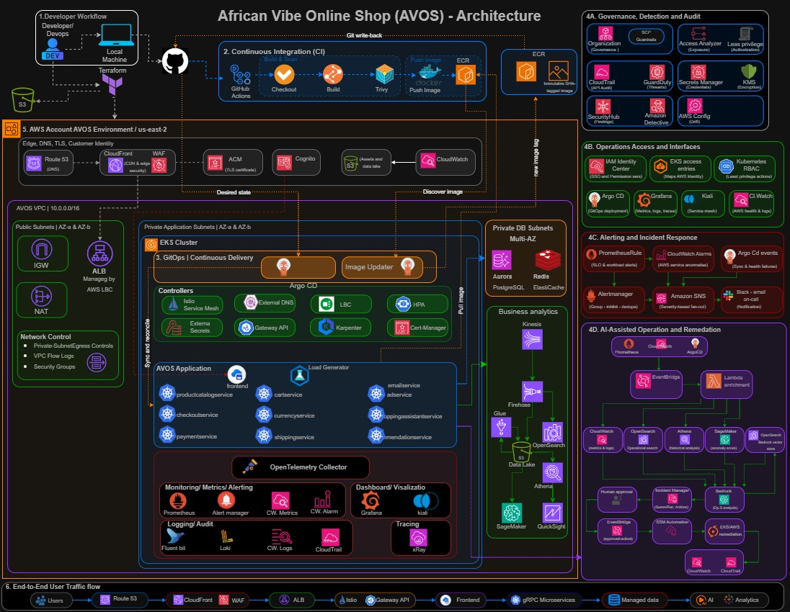
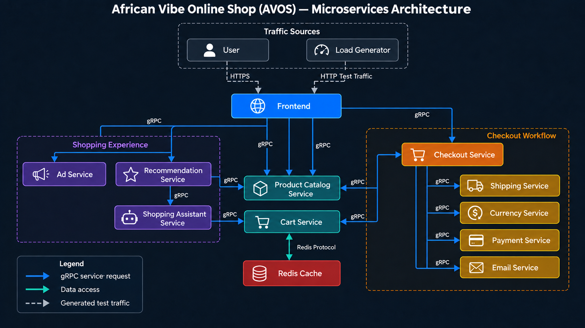
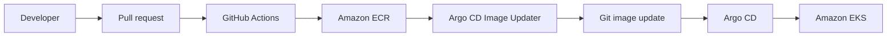
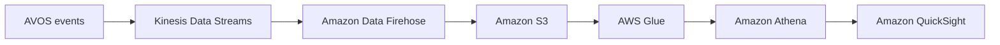

# African Vibe Online Shop (AVOS)

## AI-Enhanced, GitOps-Driven E-Commerce Platform on AWS


African Vibe Online Shop (AVOS) is a production-oriented e-commerce platform for demonstrating how polyglot microservices can be built, secured, delivered, observed, and operated on Amazon Web Services. The approved target architecture combines Amazon EKS, Terraform, Kubernetes, gRPC, Istio, GitHub Actions, Argo CD, observability, analytics, and human-approved AI-assisted operations.

> **Implementation status:** Phase 0 is complete. The application source has been rebranded and locally validated, and Phase 1 repository engineering standards are in progress. AWS infrastructure, CI, GitOps, managed data, analytics, and AIOps capabilities shown in the target architecture remain planned until their implementation phases are completed and validated.

## Table of Contents

- [Project Objectives](#project-objectives)
- [Implementation Status](#implementation-status)
- [Project Architecture](#project-architecture)
- [Microservices Architecture](#microservices-architecture)
- [Communication Rules](#communication-rules)
- [Architecture Principles](#architecture-principles)
- [Target Platform Components](#target-platform-components)
- [CI and GitOps Ownership](#ci-and-gitops-ownership)
- [Observability and Incident Response](#observability-and-incident-response)
- [Analytics and AI](#analytics-and-ai)
- [Security and Governance](#security-and-governance)
- [Repository Structure](#repository-structure)
- [Local Validation](#local-validation)
- [Project Documentation](#project-documentation)
- [License and Attribution](#license-and-attribution)

## Project Objectives

AVOS is designed to demonstrate the following engineering outcomes:

- Independently buildable polyglot microservices with strongly typed gRPC contracts.
- Repeatable AWS infrastructure provisioned through Terraform.
- Private Amazon EKS workloads with controlled ingress and service-to-service security.
- Immutable container delivery with separated CI and GitOps responsibilities.
- Unified metrics, logs, traces, dashboards, alerts, and incident evidence.
- Managed transactional data, caching, object storage, search, and analytics.
- Human-approved AIOps recommendations grounded in AVOS telemetry and runbooks.
- Phase-based implementation with validation, cleanup, cost review, and documented evidence.

## Implementation Status

The repository distinguishes completed work from approved target-state capabilities.

| Capability | Status | Short role |
|---|---|---|
| AVOS source rebranding | Implemented and locally validated | Presents the AVOS identity across the storefront and service behavior. |
| Eleven business services | Implemented and locally validated | Provides the customer, catalog, cart, checkout, and shopping-assistance capabilities. |
| Load Generator | Implemented and locally validated | Generates controlled customer traffic without being counted as a business service. |
| Non-root service containers | Implemented and locally validated | Reduces container privilege across all application images. |
| gRPC service communication | Baseline implemented | Provides strongly typed synchronous calls between business services. |
| Repository standards | In progress | Establishes ownership, contribution, scanning, formatting, and documentation controls. |
| Terraform AWS foundation | Planned rebuild | Provisions AVOS infrastructure from reviewed declarative configuration. |
| Amazon EKS platform | Planned | Runs and scales AVOS workloads in private application subnets. |
| CI workflows | Planned rebuild | Tests, scans, builds, and publishes immutable images. |
| GitOps configuration | Planned rebuild | Reconciles approved Kubernetes state through Argo CD. |
| Managed data services | Planned | Provides Aurora PostgreSQL, ElastiCache for Redis, and Amazon S3. |
| Observability and incident response | Planned | Correlates metrics, logs, traces, alerts, ownership, and runbooks. |
| Analytics platform | Planned | Streams and curates business events for governed analysis. |
| AI-assisted operations | Planned | Produces evidence-based recommendations with human-approved remediation. |

Phase 0 evidence is available in [`Docs/Phase-validation/Phase-0`](Docs/Phase-validation/Phase-0).

## Project Architecture

The approved target architecture shows the intended developer workflow, AWS environment, networking, Amazon EKS platform, managed data services, observability, governance, analytics, and AIOps capabilities.



> The diagram represents the approved target state. A component is not considered implemented or deployed until its assigned phase passes the documented validation gate.

## Microservices Architecture

AVOS contains **11 business microservices**, **one supporting load-testing workload**, and **one cart datastore dependency**.



| Component | Language | Classification | Short role |
|---|---|---|---|
| [`frontend`](src/frontend) | Go | Business service | Serves the customer interface and coordinates backend requests. |
| [`productcatalogservice`](src/productcatalogservice) | Go | Business service | Lists, searches, and retrieves AVOS product information. |
| [`cartservice`](src/cartservice) | C# | Business service | Manages cart contents for each customer session. |
| [`checkoutservice`](src/checkoutservice) | Go | Business service | Orchestrates pricing, payment, shipping, cart cleanup, and confirmation. |
| [`currencyservice`](src/currencyservice) | Node.js | Business service | Converts monetary values between supported currencies. |
| [`paymentservice`](src/paymentservice) | Node.js | Business service | Simulates payment authorization and returns a transaction identifier. |
| [`shippingservice`](src/shippingservice) | Go | Business service | Calculates shipping costs and creates shipment tracking information. |
| [`emailservice`](src/emailservice) | Python | Business service | Simulates sending order-confirmation messages. |
| [`recommendationservice`](src/recommendationservice) | Python | Business service | Recommends related products from customer shopping context. |
| [`adservice`](src/adservice) | Java | Business service | Returns contextual AVOS advertisements from request keywords. |
| [`shoppingassistantservice`](src/shoppingassistantservice) | Python | Business service | Provides conversational product discovery through AWS-oriented retrieval interfaces. |
| [`loadgenerator`](src/loadgenerator) | Python/Locust | Testing workload | Generates realistic storefront traffic for performance and resilience validation. |

The interactive dependency map can be downloaded from [`Docs/Architectures/avos-grpc-service-dependency-map.html`](Docs/Architectures/avos-grpc-service-dependency-map.html). GitHub does not execute the embedded interaction directly; download the HTML file and open it locally to use its service-selection controls.

## Communication Rules

- Customers and the Load Generator reach the frontend through HTTP or HTTPS.
- Business microservices communicate synchronously through gRPC.
- Cart Service reaches Redis through the Redis protocol, not gRPC.
- Telemetry uses OpenTelemetry, Prometheus scraping, and log forwarding rather than business APIs.
- Health, readiness, and liveness endpoints are operational interfaces, not business APIs.
- Service-specific deadlines, bounded retries, circuit breaking, and idempotency will be finalized during application-platform implementation.

## Architecture Principles

| Principle | Short role |
|---|---|
| Git as the source of truth | Preserves reviewed application and environment configuration with an auditable history. |
| Infrastructure as Code | Makes AWS infrastructure repeatable, reviewable, and recoverable. |
| Managed services first | Reduces operational work for databases, caching, identity, analytics, and AI. |
| Private-by-default workloads | Keeps nodes, pods, and data services outside public subnets. |
| Least privilege | Limits humans, pipelines, controllers, and workloads to required actions. |
| Immutable artifacts | Promotes tested container images without rebuilding them between environments. |
| Independent service delivery | Allows services to be tested, versioned, deployed, and rolled back separately. |
| Observability by design | Treats metrics, logs, traces, ownership, and runbooks as required capabilities. |
| Human-approved automation | Prevents probabilistic AI output from making uncontrolled production changes. |
| Cost-aware scalability | Uses HPA and Karpenter so capacity follows measured application demand. |

## Target Platform Components

| Layer | Approved components | Short role |
|---|---|---|
| DNS and edge | Route 53, CloudFront, ACM, AWS WAF | Resolves the domain, enforces HTTPS, caches content, and filters malicious traffic. |
| Customer identity | Amazon Cognito | Authenticates customers and issues application tokens. |
| Ingress | ALB, AWS Load Balancer Controller, Istio Gateway API | Routes approved external traffic into the Kubernetes application. |
| Compute | Amazon EKS, managed nodes, Karpenter, HPA | Runs and scales containerized workloads across private subnets. |
| Service communication | gRPC and Istio | Provides typed APIs, mTLS, traffic policy, and mesh telemetry. |
| Data | Aurora PostgreSQL, ElastiCache for Redis, Amazon S3 | Stores durable commerce records, cart state, assets, and analytical data. |
| Search and retrieval | Amazon OpenSearch Service | Supports product search, operational search, and purpose-specific vector retrieval. |
| Delivery | GitHub Actions, Amazon ECR, Argo CD, Image Updater | Builds immutable artifacts and reconciles approved releases into EKS. |
| Observability | Prometheus, Grafana, Alertmanager, Fluent Bit, Loki, OpenTelemetry, X-Ray, Kiali, CloudWatch | Correlates workload and AWS operational signals. |
| Governance | Organizations, SCPs, IAM, KMS, CloudTrail, Config, GuardDuty, Security Hub, Access Analyzer | Applies access, encryption, audit, configuration, and detection controls. |

## CI and GitOps Ownership

GitHub Actions, Argo CD Image Updater, and Argo CD have intentionally separate responsibilities.

| Component | Responsibility |
|---|---|
| GitHub Actions | Tests source, scans dependencies and images, builds containers, and publishes immutable commit-tagged images to Amazon ECR. |
| Argo CD Image Updater | Detects approved ECR images and writes the selected image reference back to the GitOps repository. |
| Argo CD | Reconciles the desired state stored in Git into Amazon EKS and reports drift or synchronization failures. |



GitHub Actions does **not** directly own GitOps image-tag changes. Image Updater is the single approved automated writer for image references.

## Observability and Incident Response

| Signal or function | Approved components | Short role |
|---|---|---|
| Metrics | Prometheus, kube-state-metrics, CloudWatch Metrics | Measures application, Kubernetes, node, mesh, and AWS behavior. |
| Dashboards | Grafana | Visualizes latency, traffic, errors, saturation, capacity, and business health. |
| Kubernetes logs | Fluent Bit and Loki | Centralizes workload logs for operational troubleshooting. |
| Distributed traces | OpenTelemetry Collector and AWS X-Ray | Correlates requests across the frontend and gRPC services. |
| Mesh visibility | Kiali | Displays Istio topology, traffic health, and mTLS state. |
| Workload alerting | PrometheusRule and Alertmanager | Evaluates, groups, deduplicates, and routes application alerts. |
| AWS alerting | CloudWatch Alarms, EventBridge, and SNS | Detects AWS service failures and sends severity-based notifications. |
| Incident response | Slack, email, on-call workflow, dashboards, and runbooks | Gives responders actionable context and approved procedures. |

## Analytics and AI

### Business analytics



| Component | Short role |
|---|---|
| Kinesis Data Streams | Ingests customer, order, and operational events without coupling analytics to checkout. |
| Amazon Data Firehose | Buffers, transforms, and delivers events to approved destinations. |
| Amazon S3 | Retains raw, curated, failed, and query-result datasets. |
| AWS Glue | Catalogs schemas and transforms raw data into curated analytical datasets. |
| Amazon Athena | Runs governed serverless SQL over data stored in S3. |
| Amazon QuickSight | Presents authorized business dashboards from validated datasets. |

### Customer-facing AI

Amazon Bedrock, Bedrock Guardrails, OpenSearch vector retrieval, and AWS Secrets Manager form the approved target for grounded shopping-assistant responses.

### AI-assisted operations

CloudWatch, Prometheus, Loki, X-Ray, Argo CD, Athena, and optional SageMaker anomaly scores provide incident evidence. EventBridge and Lambda assemble approved context, Bedrock produces a grounded recommendation, a human approves or denies action, and SSM Automation executes only allow-listed runbooks.

AI recommendations remain advisory unless a remediation is deterministic, tested, least-privileged, reversible, explicitly approved, and fully auditable.

## Security and Governance

| Control domain | Approved components | Short role |
|---|---|---|
| Edge security | CloudFront, AWS WAF, Shield Standard, ACM | Filters malicious traffic, provides baseline DDoS protection, and enforces HTTPS. |
| Network security | Private subnets, security groups, VPC Flow Logs, network policies | Restricts and records traffic across platform trust boundaries. |
| Workload security | Istio mTLS, Kubernetes RBAC, EKS Pod Identity, Kyverno | Protects service traffic and blocks noncompliant workloads. |
| Secret protection | Secrets Manager and External Secrets Operator | Delivers secrets without storing secret values in Git. |
| Supply-chain security | GitHub OIDC, Trivy, ECR scanning, protected environments | Uses short-lived credentials and scans release artifacts. |
| Encryption | AWS KMS | Encrypts supported state, storage, logs, databases, and secrets. |
| Audit and detection | CloudTrail, Config, GuardDuty, Security Hub, Access Analyzer | Records activity, detects drift and threats, and identifies unintended access. |
| Organization governance | AWS Organizations and SCPs | Applies account-level guardrails across AVOS environments. |

## Repository Structure

```text
African-Vibe-Online-Shop-AVOS/
├── .github/                    # Repository ownership and future automation controls
├── Docs/
│   ├── ADR/                    # Architecture decision records
│   ├── Architectures/          # Approved diagrams and historical versions
│   ├── Phase-validation/       # Commands, results, evidence, and sign-off by phase
│   └── Roadmap/                # Approved implementation sequence and validation gates
├── src/
│   ├── frontend/
│   ├── adservice/
│   ├── cartservice/
│   ├── checkoutservice/
│   ├── currencyservice/
│   ├── emailservice/
│   ├── paymentservice/
│   ├── productcatalogservice/
│   ├── recommendationservice/
│   ├── shippingservice/
│   ├── shoppingassistantservice/
│   └── loadgenerator/
├── gitops/                     # Rebuilt during the approved GitOps phase
├── terraform/                  # Rebuilt and validated through ordered infrastructure phases
├── .gitignore
├── LICENSE
└── README.md
```

The repository uses CloudHustler only as historical reference material. AVOS resources, workflows, manifests, documentation, and public identity are rebuilt and validated during their assigned phases.

## Local Validation

Phase 0 validated service tests, compilation, and container builds for all 12 source components. Every validated container runs as a non-root user.

Common validation entry points include:

```bash
# Go services
go test ./...
go build ./...

# Node.js services
npm ci
npm run check
npm test

# Python services
python -m unittest discover -p "test_*.py" -v
python -m compileall -q .

# Java service
./gradlew clean test --no-daemon

# Repository hygiene
git diff --check
git diff --cached --check
```

Service-specific prerequisites and commands remain documented in each service directory.

## Project Documentation

| Document | Short role |
|---|---|
| [Implementation roadmap](Docs/Roadmap/AVOS-IMPLEMENTATION-ROADMAP.md) | Defines each phase, dependency, validation gate, deliverable, cleanup activity, and senior explanation. |
| [Architecture decisions](Docs/ADR/README.md) | Records approved technical decisions and their consequences. |
| [Phase 0 inventory](Docs/Phase-validation/Phase-0/PHASE-0-BASELINE-INVENTORY.md) | Records the imported baseline without claiming deployed infrastructure. |
| [Phase 0 validation report](Docs/Phase-validation/Phase-0/PHASE-0-VALIDATION-REPORT.md) | Records source, test, container, and repository-hygiene evidence. |
| [Project architecture](Docs/Architectures/avos-project-architecture.jpg) | Shows the approved AVOS target platform. |
| [Microservices architecture](Docs/Architectures/avos-microservices-architecture.png) | Shows service dependencies and communication protocols. |

## License and Attribution

AVOS preserves applicable upstream copyright and license notices inherited with source files. Rebranding the product does not remove third-party licensing obligations.

See [`LICENSE`](LICENSE) for repository licensing information. Individual source files may contain additional notices that must remain intact.

## Phase Progress

| Phase | Status |
|---|---|
| Phase 0 — Discovery, baseline, and validation | Complete |
| Phase 1 — Repository rebrand, hygiene, and engineering standards | In progress |
| Phase 2 and later implementation phases | Planned |
