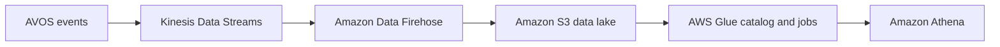
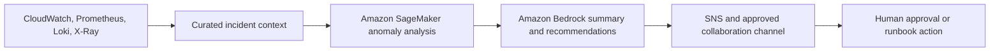
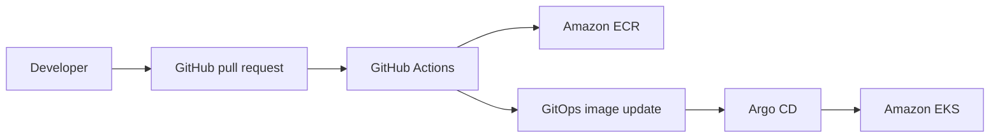

# African Vibe Online Shop (AVOS)

## AI-Enhanced GitOps E-Commerce Platform on AWS


African Vibe Online Shop (AVOS) is a production-oriented e-commerce platform that demonstrates how modern engineering teams can build, secure, deploy, observe, and operate polyglot microservices on Amazon EKS. The project combines Terraform, Kubernetes, gRPC, Istio, GitHub Actions, Argo CD, observability, analytics, and AI-assisted operations in one portfolio-ready AWS architecture.

> **Project status:** AVOS is being redesigned from an earlier platform baseline. This document distinguishes capabilities already present in the repository from additions planned for the approved AVOS target architecture.

## Table of Contents

- [Problem Statement](#problem-statement)
- [Solution Overview](#solution-overview)
- [Architecture Principles](#architecture-principles)
- [Target Architecture](#target-architecture)
- [Architecture Review Decisions](#architecture-review-decisions)
- [Microservices Architecture](#microservices-architecture)
- [Identity and Access](#identity-and-access)
- [Data Platform](#data-platform)
- [Analytics Platform](#analytics-platform)
- [Observability](#observability)
- [AI and AIOps](#ai-and-aiops)
- [Security and Governance](#security-and-governance)
- [GitOps and CI/CD](#gitops-and-cicd)
- [Technology Stack](#technology-stack)
- [Repository Structure](#repository-structure)
- [Current Implementation Status](#current-implementation-status)
- [Senior-Level Architecture Explanations](#senior-level-architecture-explanations)

## Problem Statement

Modern e-commerce teams must release features quickly without sacrificing reliability, security, scalability, or auditability. Common challenges include:

- **Slow delivery:** Manual build, approval, and deployment steps delay releases.
- **Kubernetes complexity:** Networking, scaling, security, and workload operations require consistent platform controls.
- **Limited observability:** Disconnected metrics, logs, and traces make failures difficult to diagnose.
- **Alert fatigue:** High-volume, low-context alerts slow incident response.
- **Security exposure:** Long-lived credentials, vulnerable images, excessive permissions, and configuration drift increase risk.
- **Operational overhead:** Engineers spend too much time correlating telemetry and preparing incident summaries manually.
- **Fragmented analytics:** Commerce data is difficult to turn into timely customer and business insights.

## Solution Overview

AVOS addresses these challenges through a layered AWS architecture:

- **Polyglot microservices:** Eleven business services separate customer-facing and transactional responsibilities.
- **gRPC communication:** Internal services use strongly typed, efficient synchronous contracts.
- **Amazon EKS:** Kubernetes schedules, scales, and recovers containerized workloads.
- **Istio service mesh:** Istio provides internal mTLS, traffic policy, service telemetry, and Gateway API support.
- **GitHub Actions:** Continuous integration tests, scans, builds, and publishes service images.
- **Argo CD:** GitOps continuously reconciles approved Kubernetes configuration into EKS.
- **Terraform:** Reusable modules provision AWS infrastructure consistently.
- **Defense in depth:** Edge, identity, workload, data, and governance controls protect the platform.
- **Unified observability:** Metrics, logs, and traces provide end-to-end operational visibility.
- **Analytics and AI:** Streaming data, Amazon Bedrock, SageMaker, and OpenSearch support business intelligence, customer assistance, and AIOps.

## Architecture Principles

| Principle | Role in AVOS |
|---|---|
| Git as the source of truth | Stores reviewed application and environment configuration for auditable delivery. |
| Infrastructure as Code | Makes AWS infrastructure repeatable, reviewable, and recoverable. |
| Managed services first | Reduces operational work for databases, caching, identity, and analytics. |
| Private-by-default workloads | Keeps EKS nodes, application pods, and data services outside public subnets. |
| Zero-trust service communication | Uses service identity, least privilege, and Istio mTLS for east-west traffic. |
| Independent service delivery | Allows each microservice to be tested, versioned, deployed, and rolled back separately. |
| Observability by design | Treats metrics, logs, and traces as required platform capabilities. |
| Cost-aware scalability | Combines HPA and Karpenter so capacity follows application demand. |

### Architecture Layers

| Layer | Components | Role |
|---|---|---|
| DNS and edge | Route 53, CloudFront, ACM, WAF | Resolves the domain, terminates trusted HTTPS, caches content, and filters malicious requests. |
| Identity | Amazon Cognito | Authenticates customers and issues tokens used by the application. |
| Ingress | AWS Load Balancer Controller, ALB, Istio Gateway API | Routes approved external traffic from AWS into the Kubernetes application. |
| Compute | Amazon EKS, managed node groups, Karpenter, HPA | Runs and scales AVOS containers across private application subnets. |
| Service communication | gRPC and Istio | Provides typed internal APIs, mTLS, traffic controls, and service-level telemetry. |
| Data | Aurora PostgreSQL, ElastiCache for Redis, Amazon S3 | Stores durable commerce records, cart state, static assets, and analytical data. |
| Search and AI | OpenSearch, Amazon Bedrock, Amazon SageMaker | Supports product search, vector retrieval, customer assistance, and AIOps analysis. |
| Analytics | Kinesis Data Streams, Data Firehose, S3, Glue, Athena | Captures events and makes curated data available for analysis. |
| Delivery | GitHub Actions, Amazon ECR, Argo CD, Kustomize, Helm | Builds artifacts and reconciles approved releases into EKS. |
| Observability | Prometheus, Grafana, Alertmanager, Fluent Bit, Loki, OpenTelemetry, X-Ray, Kiali, CloudWatch | Correlates metrics, logs, traces, mesh health, and AWS service events. |
| Security and governance | IAM, Pod Identity, KMS, Secrets Manager, External Secrets, CloudTrail, Config, GuardDuty, Security Hub, Organizations, SCPs | Enforces access, encryption, secret delivery, detection, audit, and organizational guardrails. |

## Microservices Architecture

AVOS contains **11 business microservices**, **one testing workload**, and **one cart datastore**.

| Service | Language | Role | Primary dependencies |
|---|---|---|---|
| [`frontend`](src/frontend) | Go | Serves the web experience and coordinates customer requests to backend services. | Catalog, cart, currency, recommendation, shipping, ad, checkout, assistant |
| [`cartservice`](src/cartservice) | C# | Adds, retrieves, and empties cart items for each customer session. | Redis |
| [`productcatalogservice`](src/productcatalogservice) | Go | Lists, searches, and retrieves product information. | JSON baseline; managed persistence planned |
| [`currencyservice`](src/currencyservice) | Node.js | Converts monetary values between supported currencies. | Exchange-rate data |
| [`paymentservice`](src/paymentservice) | Node.js | Simulates payment authorization and returns a transaction identifier. | Checkout |
| [`shippingservice`](src/shippingservice) | Go | Calculates shipping costs and creates shipment tracking information. | Checkout and frontend |
| [`emailservice`](src/emailservice) | Python | Simulates sending order-confirmation messages after checkout. | Checkout |
| [`checkoutservice`](src/checkoutservice) | Go | Orchestrates cart retrieval, pricing, payment, shipping, cart cleanup, and confirmation. | Cart, catalog, currency, payment, shipping, email |
| [`recommendationservice`](src/recommendationservice) | Python | Recommends related products from the customer’s current shopping context. | Product catalog |
| [`adservice`](src/adservice) | Java | Returns contextual advertisements based on request keywords. | Frontend |
| [`shoppingassistantservice`](src/shoppingassistantservice) | Python | Provides conversational product assistance and AWS-backed retrieval. | Bedrock, OpenSearch, Secrets Manager |
| [`loadgenerator`](src/loadgenerator) | Python/Locust | Generates synthetic HTTP traffic for resilience, scaling, and performance tests. | Frontend |

### Communication Rules

- Customers and the load generator access the frontend over HTTP or HTTPS.
- Business services communicate synchronously over gRPC.
- Cart Service communicates with Redis using the Redis protocol.
- Telemetry is exported through OpenTelemetry, Prometheus scraping, and log forwarding rather than business gRPC calls.
- Health, readiness, and liveness probes remain operational endpoints and are not business APIs.
- Timeouts, bounded retries, circuit breaking, and outlier detection will be defined per dependency.

## Identity and Access

### Customer Identity

Amazon Cognito will provide customer registration, sign-in, token issuance, password policies, optional MFA, and account recovery. The frontend will validate customer identity and propagate only the minimum identity context required by backend services.

### Platform Identity

| Control | Role |
|---|---|
| AWS IAM Identity Center | Provides centralized workforce access to AWS accounts and roles. |
| EKS access entries | Grants administrators and developers controlled Kubernetes access. |
| Kubernetes RBAC | Restricts actions inside the cluster by role and namespace. |
| EKS Pod Identity | Gives workloads short-lived AWS permissions without static access keys. |
| IAM least privilege | Limits each human, pipeline, and workload to required AWS actions. |
| Permission boundaries and SCPs | Prevent identities and accounts from exceeding approved guardrails. |

## Data Platform

| Service | Role |
|---|---|
| Amazon Aurora PostgreSQL | Stores durable relational commerce data that requires transactions and referential integrity. |
| Amazon ElastiCache for Redis | Stores low-latency shopping-cart state with managed availability. |
| Amazon S3 | Stores product assets, logs, backups, analytical data, and exported reports. |
| AWS Secrets Manager | Stores database credentials, API secrets, and other application secrets. |
| AWS KMS | Encrypts EKS secrets, storage, logs, databases, and sensitive AWS resources. |
| AWS Backup | Applies scheduled backup and retention policies to supported production resources. |

Data services will be placed in private database subnets and will accept traffic only from approved application security groups or workload identities.

## Analytics Platform



| Component | Role |
|---|---|
| Kinesis Data Streams | Ingests customer, order, and operational events in near real time. |
| Amazon Data Firehose | Buffers, optionally transforms, and delivers event data into S3. |
| Amazon S3 data lake | Retains raw and curated analytical datasets cost-effectively. |
| AWS Glue | Catalogs datasets and performs scheduled transformation jobs. |
| Amazon Athena | Runs serverless SQL queries against curated S3 data. |
| Amazon QuickSight | Provides business dashboards after the analytical datasets are validated. |

Initial use cases include customer behavior analysis, product demand trends, order reporting, recommendation features, and inventory forecasting. Fraud detection will remain a future use case until real transaction data and governance requirements are defined.

## Observability

AVOS uses separate but correlated signals for metrics, logs, traces, mesh behavior, and AWS service health.

| Signal | Components | Role |
|---|---|---|
| Metrics | Prometheus and kube-state-metrics | Collect application, Kubernetes, node, and service-mesh metrics. |
| Dashboards | Grafana | Visualizes platform health, capacity, latency, errors, traffic, and saturation. |
| Alerting | Alertmanager, SNS, and approved collaboration channels | Routes actionable alerts to responsible responders. |
| Logs | Fluent Bit and Loki | Collects and stores Kubernetes logs for centralized troubleshooting. |
| Traces | OpenTelemetry Collector and AWS X-Ray | Correlates requests across the frontend and gRPC services. |
| Mesh visibility | Kiali | Visualizes Istio topology, traffic, errors, and mTLS status. |
| AWS operations | Amazon CloudWatch | Stores AWS logs, metrics, alarms, and infrastructure events. |

## AI and AIOps

AVOS separates customer-facing AI from operational AI so each capability has a clear data boundary and permission model.

### Shopping Assistant

- **Amazon Bedrock:** Generates conversational responses without managing foundation-model infrastructure.
- **OpenSearch vector retrieval:** Finds relevant catalog context for grounded responses.
- **AWS Secrets Manager:** Stores any required application secrets securely.
- **Guardrails for Amazon Bedrock:** Filters disallowed content and constrains model interactions.

### AIOps Workflow



- **SageMaker:** Detects anomalies or predicts risk from curated operational data when a validated model is available.
- **Bedrock:** Produces incident summaries, probable causes, and runbook-based recommendations.
- **EventBridge and Lambda:** Coordinate approved enrichment and remediation workflows.
- **Human approval:** Protects production from unsafe autonomous changes.

AI-generated guidance remains advisory until a specific remediation is deterministic, tested, least-privileged, reversible, and explicitly approved for automation.

## Security and Governance

| Control domain | Components | Role |
|---|---|---|
| Edge protection | CloudFront, WAF, Shield Standard, ACM | Filters malicious traffic, provides DDoS protections, and enforces HTTPS. |
| Network security | Private subnets, security groups, network policies | Restricts connectivity between the edge, application, and data tiers. |
| Workload security | Istio mTLS, RBAC, Pod Identity, Kyverno | Protects service communication and blocks noncompliant workloads. |
| Secret protection | Secrets Manager and External Secrets Operator | Delivers secrets to workloads without storing secret values in Git. |
| Supply-chain security | GitHub OIDC, Trivy, ECR scanning, protected environments | Secures build identities and prevents known vulnerable artifacts from promotion. |
| Encryption | AWS KMS | Encrypts supported data at rest with controlled key policies. |
| Audit and configuration | CloudTrail and AWS Config | Records API activity and detects configuration drift. |
| Threat detection | GuardDuty, Security Hub, and IAM Access Analyzer | Detects threats, aggregates findings, and identifies unintended external access. |
| Organization governance | AWS Organizations and SCPs | Applies account-level guardrails across platform environments. |

## GitOps and CI/CD

GitHub Actions and Argo CD have intentionally different responsibilities.

### Continuous Integration

GitHub Actions validates source changes and produces immutable deployment artifacts.

1. Check out the service source code.
2. Configure the service language runtime.
3. Run unit and integration tests.
4. Scan source code, dependencies, and container images with Trivy.
5. Authenticate to AWS using GitHub OIDC and short-lived credentials.
6. Build and push the image to Amazon ECR using an immutable commit tag.
7. Update the approved GitOps image reference through a reviewed Git change.

### Continuous Delivery

Argo CD watches the GitOps configuration and reconciles it into Amazon EKS.

- **Synchronization:** Applies the declared Kubernetes configuration.
- **Drift detection:** Identifies differences between Git and the live cluster.
- **Self-healing:** Restores resources changed outside the approved workflow.
- **Rollback:** Returns the environment to a previously known-good Git revision.
- **Auditability:** Preserves the change, approval, image, and deployment history.



## Technology Stack

| Category | AVOS technology |
|---|---|
| Cloud platform | AWS |
| Frontend | Go templates, HTML, CSS, and JavaScript |
| Backend languages | Go, C#, Node.js, Python, and Java |
| Internal communication | gRPC and Protocol Buffers |
| Container platform | Kubernetes and Amazon EKS |
| Service mesh | Istio |
| North-south routing | Route 53, CloudFront, WAF, ALB, AWS Load Balancer Controller, Istio Gateway API |
| Customer identity | Amazon Cognito |
| Relational data | Amazon Aurora PostgreSQL |
| Cart persistence | Amazon ElastiCache for Redis |
| Object storage and data lake | Amazon S3 |
| Search and retrieval | Amazon OpenSearch |
| Analytics | Kinesis Data Streams, Data Firehose, AWS Glue, Athena, and QuickSight |
| Customer AI and AIOps | Amazon Bedrock and Amazon SageMaker |
| Container registry | Amazon ECR |
| Continuous integration | GitHub Actions |
| GitOps delivery | Argo CD and Kustomize |
| Package management | Helm |
| Infrastructure as Code | Terraform |
| Metrics and dashboards | Prometheus, Grafana, Alertmanager, and CloudWatch |
| Logs | Fluent Bit and Loki |
| Tracing | OpenTelemetry Collector and AWS X-Ray |
| Mesh observability | Kiali |
| Security | IAM, Pod Identity, KMS, Secrets Manager, Trivy, Kyverno, RBAC, WAF, GuardDuty, Security Hub, Config, and CloudTrail |

## Repository Structure

The current repository is organized around application source code, GitOps configuration, and layered Terraform roots.

```text
African-Vibe-Online-Shop-AVOS/
├── .github/
│   └── workflows/                  # Reusable and service-specific CI workflows
├── src/
│   ├── frontend/
│   ├── adservice/
│   ├── cartservice/
│   ├── checkoutservice/
│   ├── currencyservice/
│   ├── emailservice/
│   ├── paymentservice/
│   ├── productcatalogservice/
│   ├── recommendationservice/
│   ├── shippingservice/
│   ├── shoppingassistantservice/
│   └── loadgenerator/
├── gitops/
│   ├── argocd/                     # Root application, projects, and child Applications
│   ├── base/                       # Reusable Kubernetes manifests
│   └── overlays/                   # Environment-specific Kustomize configuration
├── terraform/
│   ├── bootstrap/                  # Remote state, locking, and foundational encryption
│   ├── organization/               # AWS Organizations, OUs, and SCPs
│   ├── identity/                   # IAM and platform service roles
│   ├── governance/                 # CloudTrail, Config, GuardDuty, and Security Hub
│   ├── networking/                 # VPC, subnets, routing, security groups, ALB, ACM, and DNS
│   ├── security/                   # Regional security controls
│   ├── container-platform/         # EKS, node groups, add-ons, and cluster access
│   ├── platform-services/          # Istio, Argo CD, observability, scaling, and operators
│   ├── edge-security/              # CloudFront, edge WAF, security headers, and public DNS
│   ├── ci/                         # ECR repositories and GitHub OIDC roles
│   └── modules/                    # Reusable Terraform modules
├── docs/                           # Architecture, validation, runbooks, and interview material
├── scripts/                        # Validation, operations, and automation utilities
├── .gitignore
├── LICENSE
└── README.md
```

## Current Implementation Status

| Capability | Status | Required AVOS work |
|---|---|---|
| Eleven business-service source directories | Baseline present | Complete rebranding, API review, tests, and AWS-specific changes. |
| Load Generator | Baseline present | Keep separate from the business-service count and align test scenarios with AVOS. |
| gRPC service communication | Baseline present | Standardize contracts, deadlines, retries, health checks, and telemetry. |
| Terraform AWS foundation | Baseline present | Rename resources, validate modules, and remove obsolete references. |
| EKS and platform services | Baseline present | Recreate through the approved AVOS roadmap and validation gates. |
| CloudFront, WAF, and ALB path | Baseline present | Rename domain resources and connect them to the approved Gateway API design. |
| Istio routing | Modification required | Replace legacy Gateway and VirtualService resources with Gateway API resources. |
| CI workflows | Partial | Add workflows for ad, email, recommendation, shopping assistant, and load generation. |
| GitOps manifests | Partial | Add base and environment overlays for the missing services. |
| Redis | Modification required | Use in-cluster Redis for early development only and ElastiCache for the production target. |
| Shopping Assistant | Replacement required | Replace Gemini, Google Secret Manager, AlloyDB, and Google embeddings with approved AWS services. |
| Cognito | Planned | Add customer authentication after identity flows and application changes are designed. |
| Analytics | Planned | Add the streaming and data-lake pipeline after event contracts are approved. |
| AIOps | Planned | Add it after observability data is reliable and incident workflows are defined. |
| Documentation and diagrams | In progress | Produce the approved draw.io-style architecture set and phase-based documents. |

## Senior-Level Architecture Explanations

1. **We separated build automation from deployment reconciliation.** GitHub Actions tests, scans, and publishes immutable images, while Argo CD deploys only the state declared in Git. This reduces cluster credentials in CI and gives us a clear audit trail and rollback path.

2. **We use gRPC internally without forcing it onto external customers.** Browser traffic remains standard HTTPS, while internal services receive strongly typed, efficient contracts. This keeps the public interface simple and makes service-to-service behavior explicit.

3. **We retained Istio but modernized its ingress API.** Istio still provides mTLS, traffic control, and telemetry, while Gateway API replaces implementation-specific routing resources with portable Kubernetes objects such as GatewayClass, Gateway, and HTTPRoute.

4. **We distinguish operational search from the logging system.** Loki remains the cost-conscious store for Kubernetes logs, while OpenSearch supports product search, vector retrieval, and selected analytical or AIOps queries. This prevents overlapping platforms from being introduced without a clear purpose.

5. **We sequence AI after telemetry and governance.** SageMaker and Bedrock will consume curated operational signals and approved runbooks only after metrics, logs, traces, access controls, and incident procedures are reliable. This makes AI an auditable decision-support layer instead of an unsafe replacement for platform engineering.

## Next Architecture Deliverables

1. Approve the complete AVOS project architecture and component decisions.
2. Create the final draw.io-style project, security, observability, GitOps, analytics, and AI architecture diagrams.
3. Define service APIs, data ownership, failure boundaries, and timeout or retry policies.
4. Create the detailed phase-by-phase execution roadmap and validation checkpoints.
5. Finalize the repository structure before implementation begins.
